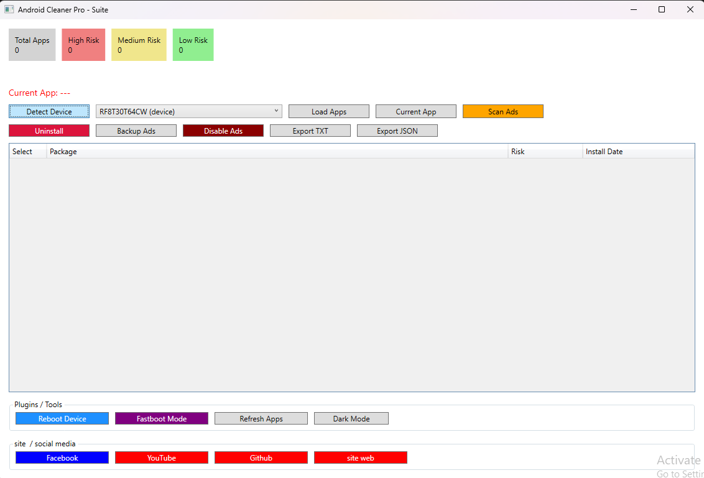
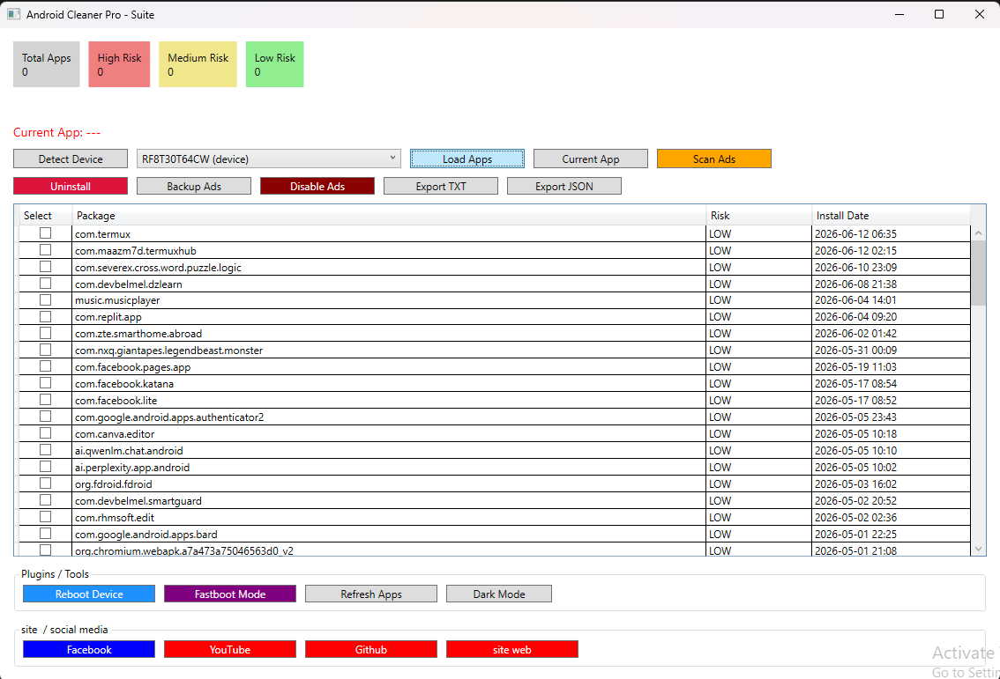
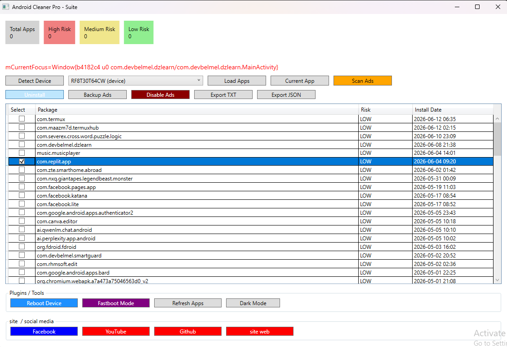
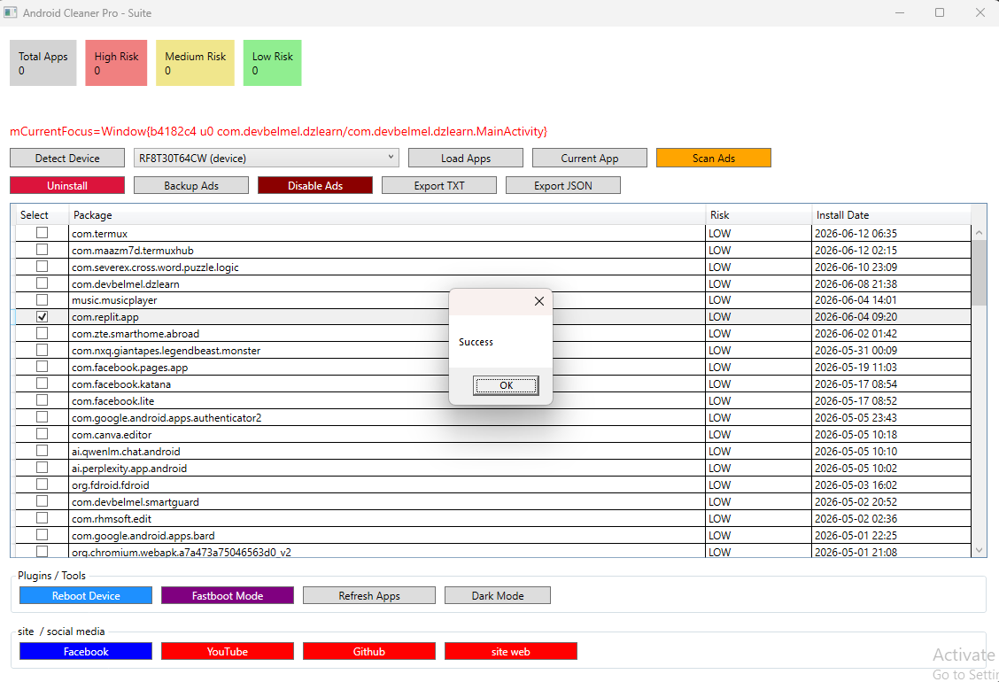
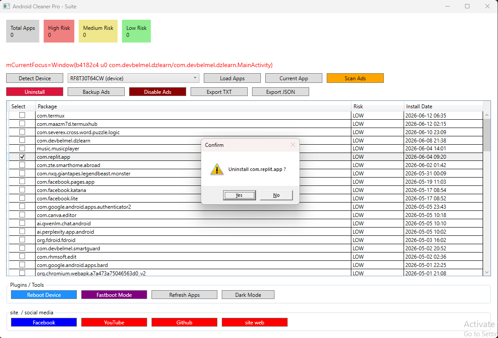

# Android Cleaner Pro

## 🚀 Overview

Android Cleaner Pro is a Windows desktop application designed to help users analyze, monitor and manage Android devices using Android Debug Bridge (ADB).

The application provides a professional interface for:

- Detecting connected Android devices
- Listing installed applications
- Displaying installation dates
- Risk classification
- Removing unwanted applications
- Monitoring foreground applications
- Exporting reports

---

# 🎥 Demo Video

Click the image below to watch the full demonstration:

---

# ✨ Features

## 📱 Device Management

- Detect Android devices using ADB
- Display device information:
  - Brand
  - Model
  - Android version
  - Serial number

## 📦 Application Scanner

Analyze installed applications:

- Package name
- Installation date
- Risk level
- Selection system

## 🗑 Application Removal

Remove unwanted applications directly:

- Select application
- Press Uninstall
- Execute ADB uninstall command

## 📊 Run App

-Get the application run in frontend devices

## 📊 Dashboard

Real-time statistics:

- Total applications
- High risk apps
- Medium risk apps
- Low risk apps

## 🔍 Monitoring

Current features:

- Foreground application detection
- Advertisement log scanning
- Application analysis

---

# 🛠 Technology Stack

| Technology | Usage |
|---|---|
| C# | Main programming language |
| .NET 9 Windows | Application framework |
| WPF | User Interface |
| ADB | Android communication |
| MVVM | Application architecture |

---

# ⚙ Requirements

## Windows

Supported:

- Windows 10
- Windows 11

## Runtime

The application is published as:
